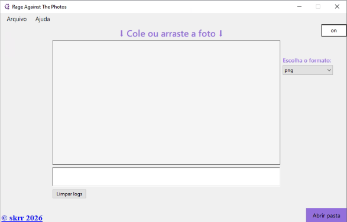
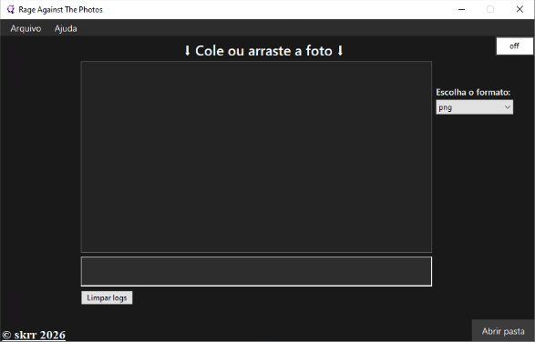

# Rage Against The Photos

Conversor de imagens simples e gratuito para Windows.

O Rage Against The Photos foi desenvolvido para facilitar a conversão
de imagens entre diferentes formatos, com suporte especial para arquivos
HEIC.

## 🖼️ Interface

O programa possuí suporte ao tema claro e tema escuro

### Tema claro

### Tema escuro

## 📥 Download

**[⬇️ Baixar a versão mais recente](https://github.com/skrdkrt069/RageAgainstThePhotos/releases/latest)**

A versão mais recente está disponível na página de Releases.

## ✨ Recursos

- Conversão de imagens entre formatos suportados
- Suporte a HEIC
- Suporte a PNG, JPG, JPEG, WEBP e ICO
- Conversão para ICO com tamanhos personalizados
- Menu de contexto do Windows
- Preferências persistentes
- Tema claro e escuro
- Changelog integrado
- Verificação de atualizações
- Histórico de conversões

## 🖼️ Formatos suportados

| Formato | Entrada | Saída |
|---|:---:|:---:|
| HEIC | ✅ | ✅ |
| PNG | ✅ | ✅ |
| JPG | ✅ | ✅ |
| JPEG | ✅ | ✅ |
| WEBP | ✅ | ✅ |
| ICO | ✅ | ✅ |

## 💻 Requisitos

- Windows
- .NET 10.0 Runtime

## 📖 Changelog

As alterações de cada versão podem ser encontradas na página
de Releases e no Changelog integrado ao aplicativo.

## 🐛 Problemas e sugestões

Encontrou um problema ou tem uma sugestão?

Abra uma Issue neste repositório.

## 📦 Releases

**[Ver todas as versões](https://github.com/skrdkrt069/RageAgainstThePhotos/releases)**

## 👨‍💻 Desenvolvedor

Desenvolvido por **♱ skrdkrt**.

## 📄 Licença

Esse projeto está disponível sob a [MIT License](LICENSE)
